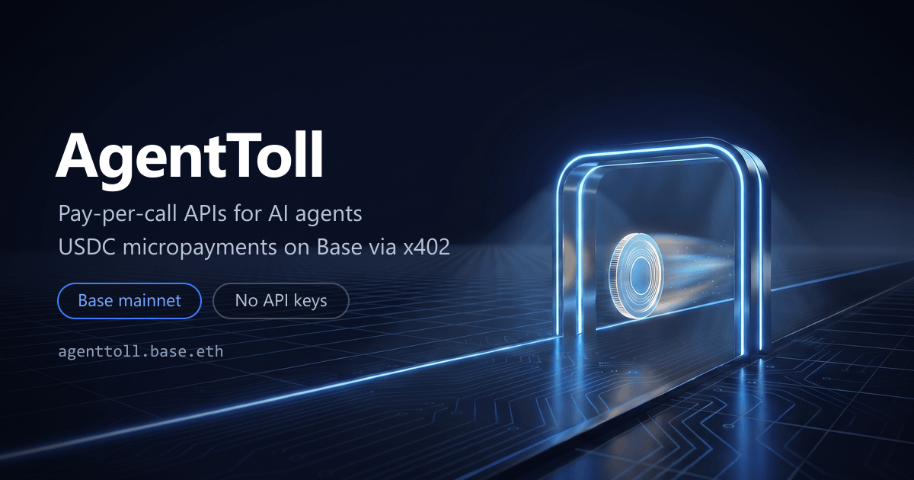

<p align="center">
  
</p>

<h1 align="center">AgentToll</h1>

<p align="center">
  <a href="https://www.npmjs.com/package/agenttoll-mcp"></a>
  
  
  
</p>

**Live:** [agenttoll.app](https://agenttoll.app) — try `GET /api/price/eth` and get a real x402 quote.
Onchain identity: **agenttoll.base.eth** (Base mainnet).

**Base-native onchain data for AI agents, pay-per-call.** Base gas, any token price by
contract address, address analytics, DEX pools, a spam-filtered new-token radar, plus
market and Turkish-lira feeds. Every endpoint costs a fraction of a cent, paid in USDC
and settled on [Base](https://base.org) via the [x402 protocol](https://x402.org).
No API keys, no subscriptions, no accounts — an agent sends one HTTP request, pays
inline, and gets the data.

> Base's stated goal is to be the default chain for AI agents. AgentToll is a small,
> open building block for that: a tollbooth any agent can drive through autonomously.

## How it works

1. An agent calls an endpoint → the server replies `402 Payment Required` with a machine-readable price quote.
2. The agent signs a USDC payment authorization (EIP-3009) for the quoted amount — no gas needed on the client.
3. The request retries with the `X-PAYMENT` header. The facilitator verifies and settles on Base; the data comes back in the same round trip.

## Endpoints

| Endpoint | Description | Price |
|---|---|---|
| `GET /api/price/:symbol` | Spot price (USD) + 24h change for any asset | $0.001 |
| `GET /api/gas?gasLimit=` | Base gas price + latest block; with `gasLimit`, what a transaction of that size costs in ETH and USD | $0.001 |
| `GET /api/trending?limit=` | Tokens trending across the market right now | $0.002 |
| `GET /api/base/token/:address` | Onchain USD price for any Base token by contract address | $0.001 |
| `GET /api/base/address/:address` | Base address snapshot: primary basename, ETH balance, tx count, contract or EOA | $0.001 |
| `GET /api/base/portfolio/:address?minValue=&limit=` | Everything an address holds on Base, valued in USD: ETH + ERC-20s, largest first | $0.003 |
| `GET /api/base/safety/:address` | Token safety checks: honeypot, taxes, owner privileges, holder concentration, liquidity risk | $0.003 |
| `GET /api/base/name/:nameOrAddress` | Basename both ways: name → address + text records, or address → primary name | $0.001 |
| `GET /api/feargreed?days=` | Crypto Fear & Greed index, plus up to 30 days of daily history | $0.001 |
| `GET /api/base/trending?limit=` | Trending DEX pools on Base: price, volume, liquidity | $0.002 |
| `GET /api/brief?symbols=` | One-call market brief: prices (BTC/ETH/SOL by default), Base gas, sentiment | $0.005 |
| `GET /api/base/radar?minLiquidity=&limit=` | New token radar: fresh Base pools above your liquidity floor | $0.003 |
| `GET /api/try/premium?asset=` | Turkish lira premium: implied vs official USD/TRY, via BTC, ETH, USDT or USDC | $0.002 |
| `GET /api/watch/address/:address?since=` | New activity for a Base address since your cursor | $0.002 |
| `GET /api/watch/radar?since=` | Only the Base pools that appeared since your cursor | $0.003 |
| `GET /api/watch/price/:symbol?ref=&pct=` | Price alert check: triggered true/false against your threshold | $0.001 |
| `GET /api/stats` | Onchain toll counter: calls, USDC revenue, unique payers — and the same excluding our own test wallet | free |
| `GET /api/catalog` | Machine-readable catalog of everything for sale | free |
| `GET /api/demo` | Sample response shapes for every paid endpoint | free |
| `GET /api/health` | Service status | free |

Responses are served from a short-lived cache (15-300s depending on endpoint) to
keep upstream sources happy; every paid call still settles onchain.

**Failed requests are never charged.** Settlement only runs after the handler
returns a success status — if an upstream is down you get the error and keep
your USDC. (Verified against production: a 502 response left the caller's
balance untouched.) A malformed request returns `400`; a genuine upstream
failure returns `502`. Neither is billed.

**Multiple sources per endpoint.** Public data APIs rate-limit and wobble, so
the ones that matter fall through to a backup rather than failing:

| Data | Primary | Fallbacks |
|---|---|---|
| Asset prices | CoinGecko | Binance → Coinbase |
| Base token price | GeckoTerminal | DexScreener |
| Base RPC (gas, address) | mainnet.base.org | publicnode → llamarpc |
| Portfolio holdings | Blockscout | Multicall3 onchain + DefiLlama |
| Token safety | GoPlus + honeypot.is together | either alone, with the rest reported as unchecked |

Price responses carry a `source` field so you can see which one answered.

A fallback that can only see part of the picture says so rather than quietly
answering short: if the portfolio indexer is down, the onchain path covers major
Base tokens only and the reply comes back with `partial: true` and a `note`
explaining what is missing. The same flag appears when an address holds more
tokens than one call can enumerate.

The safety endpoint takes this furthest, because there the cost of a confident
wrong answer is someone's money. Its two sources answer different questions —
GoPlus reads the contract, honeypot.is simulates a real buy and sell — so it
queries both and merges rather than falling through. Any check it could not run
is reported as `unknown`, and a token with unknown checks is never graded
`clear`; it comes back as `insufficient-data`. A brand-new token with no holder
or liquidity history looks exactly like a clean one to a naive checker, and that
is precisely the token someone is about to lose money on.

### Optional parameters

The listing endpoints take optional query parameters. They never change the
price, and an out-of-range value returns `400` rather than being silently
clamped — a call you did not intend is not a call you should pay for.

```bash
curl "https://agenttoll.app/api/gas?gasLimit=150000"        # + estimate.usdCost for a swap
curl "https://agenttoll.app/api/feargreed?days=7"           # + a week of daily history
curl "https://agenttoll.app/api/base/radar?minLiquidity=50000&limit=5"
curl "https://agenttoll.app/api/brief?symbols=eth,degen,aero"
curl "https://agenttoll.app/api/try/premium?asset=usdt"     # the reading desks actually quote
```

The upstream response is cached whole and filtered per caller, so a narrower or
wider request never costs an extra upstream call.

### Watch endpoints (stateless diffs)

The `/api/watch/*` family answers "what changed since I last asked". Each reply
carries a `cursor`; pass it back as `?since=` on the next call and you get only
the new events. The agent holds the cursor, so the server stores nothing about
you — no accounts, no subscriptions, still no state.

```bash
# first call — everything recent, plus a cursor
curl "https://agenttoll.app/api/watch/radar"          # -> { pools: [...], cursor: "2026-08-05T08:40:01Z" }
# later — only what appeared since
curl "https://agenttoll.app/api/watch/radar?since=2026-08-05T08:40:01Z"
```

### Agent-native discovery

Agents (and indexers) can find and understand the service without reading the site:

| Spec | URL |
|---|---|
| x402 discovery | [`/.well-known/x402`](https://agenttoll.app/.well-known/x402) |
| OpenAPI | [`/openapi.json`](https://agenttoll.app/openapi.json) |
| llms.txt | [`/llms.txt`](https://agenttoll.app/llms.txt) |

The 402 challenge carries its own documentation. Every paid endpoint declares
the x402 bazaar discovery extension, so the payment quote itself contains the
request shape, the path and query parameters, and a real response example — an
agent that has only ever seen a 402 can already build the call, with no second
request for a spec that might not answer.

## Quickstart (server)

```bash
git clone https://github.com/agenttoll/agenttoll
cd agenttoll
npm install
cp .env.example .env   # set ADDRESS to the wallet that should receive payments
npm run dev
```

The server starts on `http://localhost:4021` in **Base Sepolia testnet** mode using the
free public facilitator (`https://x402.org/facilitator`).

Calling a paid endpoint without payment returns the 402 quote:

```bash
curl -i http://localhost:4021/api/price/eth
# HTTP/1.1 402 Payment Required
# PAYMENT-REQUIRED: <base64 quote — accepts[], plus the request and response schemas>
```

## Quickstart (paying agent)

x402 v2 takes the network in CAIP-2 form and a payment scheme registered for it:

```ts
import { createPublicClient, http } from "viem";
import { base } from "viem/chains";
import { privateKeyToAccount } from "viem/accounts";
import { wrapFetchWithPaymentFromConfig } from "@x402/fetch";
import { ExactEvmScheme, toClientEvmSigner } from "@x402/evm";

const account = privateKeyToAccount(AGENT_KEY);
const publicClient = createPublicClient({ chain: base, transport: http() });

const pay = wrapFetchWithPaymentFromConfig(fetch, {
  schemes: [
    { network: "eip155:8453", client: new ExactEvmScheme(toClientEvmSigner(account, publicClient)) },
  ],
});

const res = await pay("https://agenttoll.app/api/price/eth");
console.log(await res.json()); // { symbol: "eth", usd: ..., change24h: ... }
```

The settlement receipt comes back in the `payment-response` header. `src/pay.ts`
wraps this for our own scripts if you want it in one call.

Or run the bundled example (needs a funded Base Sepolia test wallet — get testnet USDC
at [faucet.circle.com](https://faucet.circle.com)):

```bash
npm run example:client
```

## Use it as an MCP server (Claude & friends)

AgentToll ships an MCP wrapper: add it to any MCP-compatible agent and the whole
API becomes native tools — each call paid automatically in USDC via x402.

```json
{
  "mcpServers": {
    "agenttoll": {
      "command": "npx",
      "args": ["-y", "agenttoll-mcp"],
      "env": { "AGENT_PRIVATE_KEY": "0x..." }
    }
  }
}
```

No clone needed — the server is on npm as
[`agenttoll-mcp`](https://www.npmjs.com/package/agenttoll-mcp).

Tools exposed: `get_price`, `get_base_gas`, `get_trending`, `get_base_token_price`,
`get_base_address_info`, `get_fear_greed`, `get_base_trending_pools`, `get_market_brief`,
`get_new_token_radar`, `get_try_premium`, `resolve_basename`, `watch_base_address`,
`watch_new_tokens`, `watch_price_alert`.

The wallet behind `AGENT_PRIVATE_KEY` needs USDC on Base — the hosted service
settles on mainnet. (Against a self-hosted testnet instance it needs Base Sepolia
USDC — free at [faucet.circle.com](https://faucet.circle.com).)

## Mainnet vs testnet

The hosted service runs on **Base mainnet** and settles real USDC. A fresh clone
defaults to **Base Sepolia** with the free public facilitator, so you can develop
without real funds. To run your own instance on mainnet, set `NETWORK=base` plus
`CDP_API_KEY_ID` / `CDP_API_KEY_SECRET` (Coinbase Developer Platform keys) — the
server picks the CDP facilitator automatically.

## Roadmap

Shipped:

- [x] Base-native data: onchain token prices, address analytics, DEX pools, new-token radar
- [x] Basename resolution both ways, with text records
- [x] Watch endpoints — stateless diffs so scheduled agents only fetch what changed
- [x] Base mainnet, settled through the Coinbase CDP facilitator
- [x] Every endpoint indexed in the CDP x402 Bazaar
- [x] MCP server on npm (`agenttoll-mcp`), published from CI
- [x] Agent-native discovery: `/api/catalog`, `/.well-known/x402`, `openapi.json`, `llms.txt`
- [x] Onchain toll counter, with the operator's own test wallet reported separately
- [x] Backup data sources per endpoint, so one provider rate-limiting us is not an outage
- [x] Wallet portfolio: every token an address holds on Base, with USD value
- [x] Schemas inside the 402 quote, so discovery never depends on a second request
- [x] Token safety checks: honeypot simulation, taxes, owner privileges, holder concentration, liquidity

Next:

- [ ] Turkish market data beyond the lira premium (local exchange spreads)
- [ ] A directory of x402 services agents can call, served over x402 itself

## Stack

TypeScript · Express · [`@x402/express`](https://www.npmjs.com/package/@x402/express) ·
[`@x402/fetch`](https://www.npmjs.com/package/@x402/fetch) ·
[`@x402/extensions`](https://www.npmjs.com/package/@x402/extensions) · viem · Base

## Development

```bash
npm install
npm run build        # type-check and compile the API
npm run dev          # local server on :4021 (defaults to Base Sepolia)
npm run build:web    # rebuild the browser demo bundle (public/demo.js)
npm run brand:png    # re-export the brand assets
```

`mcp/` is a separate package; bump its version and push a `mcp-v*` tag to publish it.

### Staying discoverable

CDP's x402 Bazaar drops a resource from discovery after 30 days without a
settled payment. `scripts/keep-warm.mjs` makes one small paid call a day,
rotating through the catalogue so every endpoint is touched about every two
weeks (~$0.002/day). It runs from `.github/workflows/keep-warm.yml` and needs
an `AGENT_WALLET_KEY` secret — a throwaway wallet holding a little USDC on
Base, nothing else.

## License

MIT — open source, building in public.
